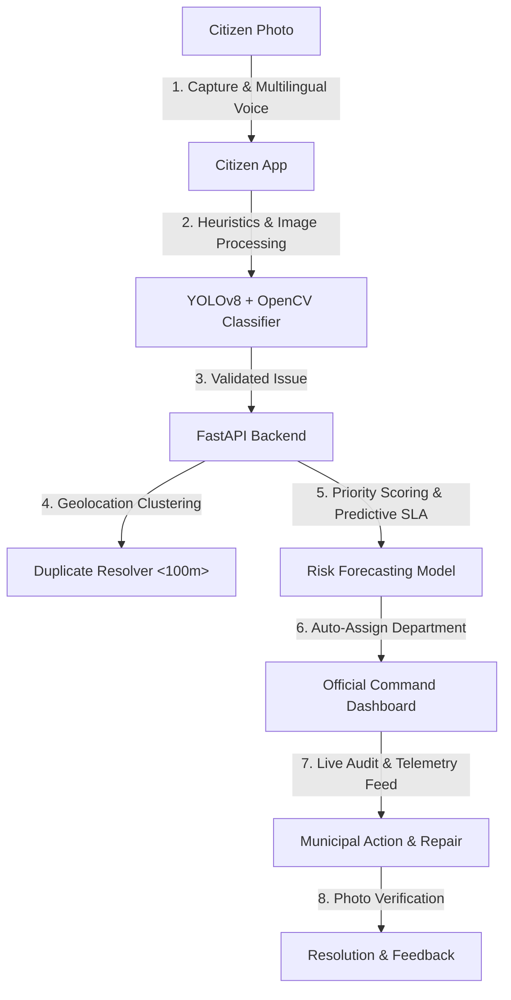

<div align="center">

# 🇮🇳 Bharat Infra Sentinel AI
### **Predictive Civic Infrastructure Monitoring & Automated SLA Dispatch System**

[](https://fastapi.tiangolo.com)
[](https://react.dev)
[](https://tailwindcss.com)
[](https://leafletjs.com)
[](https://www.sqlite.org)
[](https://opencv.org)

**Empowering safer, smarter, and more responsive cities through visual AI detection, predictive risk modeling, and a real-time unified telemetry dashboard.**

</div>

---

## 🚀 One-Line Pitch
**Bharat Infra Sentinel AI** turns citizen-submitted photos into predictive maintenance intelligence—combining on-device AI visual validation, 30-day failure/escalation forecasting, and a high-density regional Command Dashboard with automated SLA-bound dispatching.

---

## 💡 System Architecture Flow


---

## ✨ Features That Win Hackathons

### 1. 📱 Unified, OTP-Gated Citizen Portal
* **One-Click Secure Entry**: Built-in OTP simulation for phone number verification, keeping user identity protected.
* **Privacy-First Profiles**: Renders custom initials-based avatar chips and masked contact info (e.g., `98765*****21`).
* **Interactive History & Tabs**: Seamlessly toggle between **New Report Submission** (with optional voice input support) and **My Reports history** tracking.
* **Real-time User Analytics**: Computes individual civic contribution statistics directly from dynamic user data (Total Reports, In Progress, Resolved).
* **Multi-Status Filters**: Track issue progression under active tabs aligning to `All`, `Reported` (Open), `In Progress`, and `Resolved` states.

### 2. 🏛️ Government Command Center & Dashboard
* **Dynamic SLA Tracking & Map**: High-density interactive Leaflet map featuring marker clustering, dynamic ward filter search, and color-coded telemetry links.
* **Department-Level Performance Panel**: Active breakdown of municipal departments showing aggregate issue count, resolution rates, average fix times (in days), and real-time SLA breach tallies highlighted in crimson warnings.
* **System Audit Feed**: Real-time event log streaming all admin activities, official logins, contractor assignments, and SLA breach updates.
* **Active Status Color System**:
  | Status | Palette (RGB/Hex) | Application |
  | :--- | :--- | :--- |
  | 🔴 **Reported / Open** | `#dc2626` (Red) | High-priority immediate alert |
  | 🔵 **In Progress** | `#2563eb` (Blue) | Assigned, tracked action |
  | 🟢 **Resolved** | `#16a34a` (Green) | Completed, citizen verified |

### 3. 🧠 AI Visual Detection & SLA Predictor Heuristics
* **Smart Heuristics**: Multi-class detection pipelines separating Potholes, Waterlogging, Garbage, and Streetlights.
* **Proactive SLA Engine**: Evaluates population density, ward load, and hazard levels to output a 30-day escalation risk percentage.
* **Forecast Simulation**: Simulates the system-wide impact of resolving top-N prioritized issues, calculating immediate improvement to the city's overall **Ward Health Index**.

### 4. 🌐 Complete Localization & Dark Mode
* **10+ Regional Languages**: Complete translation dictionaries for English, Bengali, Gujarati, Kannada, Tamil, Malayalam, Marathi, and more.
* **Adaptive Dark Mode**: Toggle between premium light mode interfaces and high-density dark mode styling (featuring custom HSL purple, pink, and amber accents).

---

## 🛠️ Technology Stack
* **Frontend**: React 18, Vite, Tailwind CSS, Leaflet Map (`react-leaflet`, `react-leaflet-cluster`), Recharts, i18next (Multilingual), Lucide React.
* **Backend**: FastAPI (Python 3.10+), SQLite database, SQLAlchemy ORM, Uvicorn ASGI.
* **AI Pipelines**: OpenCV Heuristics, YOLOv8 visual classifier models.

---

## ⚙️ Quick Start (Dev)

### 📋 Prerequisites
* Node.js (v18+)
* Python (3.10+)

### 💻 Installation & Running

Open two terminal sessions to run both servers simultaneously:

#### Terminal 1: FastAPI Backend
```powershell
cd backend
python -m venv .venv
# Activate virtual environment
# Windows:
.venv\Scripts\activate
# Linux/macOS:
source .venv/bin/activate

# Install requirements
pip install -r requirements.txt

# Run database migrations / seed data
python seed.py

# Launch development server
uvicorn app.main:app --reload --port 8000
```

#### Terminal 2: Vite React Frontend
```powershell
cd frontend
npm install
npm run dev
```

* **Frontend Dev Server**: [http://localhost:5173](http://localhost:5173)
* **API Documentation**: [http://localhost:8000/docs](http://localhost:8000/docs)
* **Demo Admin Credentials**: Official ID: `admin` | Security Key: `admin123`

---

## 💎 Hackathon Demo Script (What to Showcase)
1. **The Telemetry Landing Hero**: Open the landing page, switch language to Tamil or Marathi, and observe the live ticking telemetry feed and automated testimonials adapting to system updates.
2. **Citizen Portal Flow**: Log in using the simulated OTP pathway, submit a new report, switch to the "My Reports" tab, filter by status, and click an issue to open the read-only inspection modal.
3. **The Executive Dashboard**: Login as admin and view the interactive clustering map. Highlight the **Department Performance breakdown** and notice the average resolution times and breach counts.
4. **Interactive Audit & Simulation**: Scroll the live System Audit Feed to verify audit logs, then simulate resolving the top 10 reports in the queue to observe the immediate update of the regional Health Index.

---
*Built for Bharat Academix CodeQuest 2026. Data-dense, automated, and designed to impress.*
